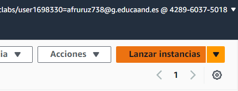

# Creacion_completa_pila_LAMP

## Creación de una maquina en un laboratorio de AWS

1º Lo primero que tenemos que hacer es Lanzar la instancia.



## Instalación de la pila LAMP
1º Instalamos y actualiamos el servidor WEB Apache 2.4

````
sudo apt install apache2 -y

````
 
